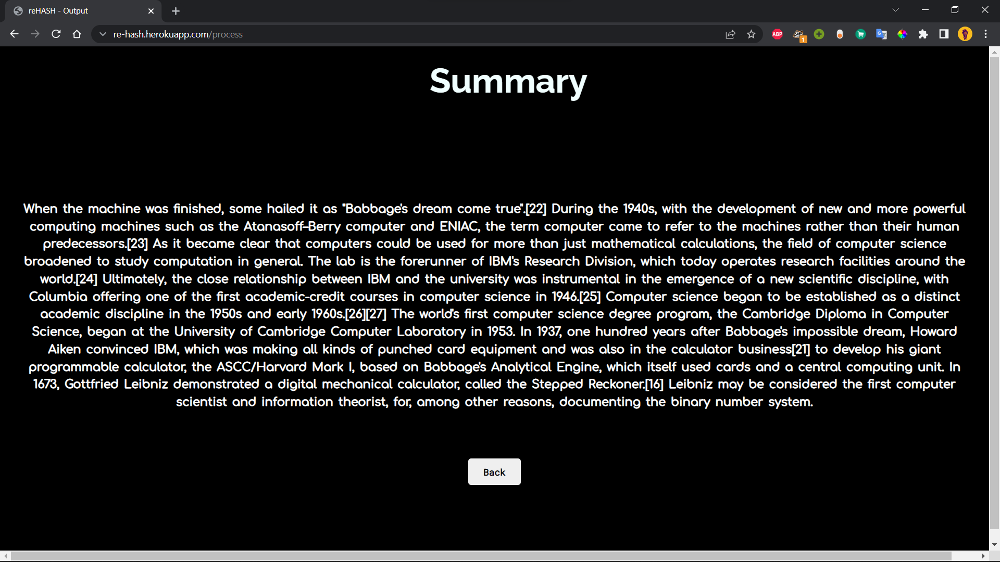

<div allign="center">

# 
<div/>

# re-HASH
<table>
<tr>
<td>
  This is a text-summarizer that uses NLP & spaCy library to wrap up a text to a specified short length.
</td>
</tr>
</table>

## Demo


Here is a working live [demo](https://re-hash.herokuapp.com/) :

### Landing Page




## Built with 

- [Natural Language Processing (NLP)](https://www.ibm.com/cloud/learn/natural-language-processing#:~:text=Natural%20language%20processing%20(NLP)%20refers,same%20way%20human%20beings%20can.)
- [spaCy](https://spacy.io/)
- [Flask](https://flask.palletsprojects.com/en/2.0.x/)
- [Heroku](https://www.heroku.com/)

---

### Run it Locally

1. Create a Virtual Envnvironment (Make sure you have latest version of [```Python```](https://www.python.org/downloads/) preinstalled.)
```
> mkdir myproject
> cd myproject
> py -3 -m venv venv
```
2. Install [```Flask```](https://flask.palletsprojects.com/en/2.0.x/installation/#install-flask)
```
> venv\Scripts\activate
$ pip install Flask
```
3. Install from ```requirements.txt``` OR manually install the dependencies.
```
> pip install -U pip setuptools wheel
> pip install -U spacy
> python -m spacy download en_core_web_sm
```
The site will be hosted on {LocalHost:5000}

---

## License

 Licensed under MIT © [Debakalpa Roy](https://github.com/debakalparoy/reHASH/blob/main/LICENSE)